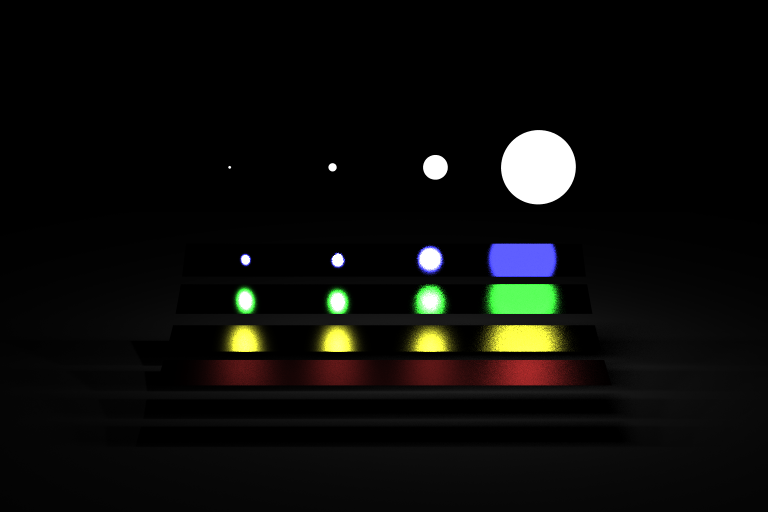
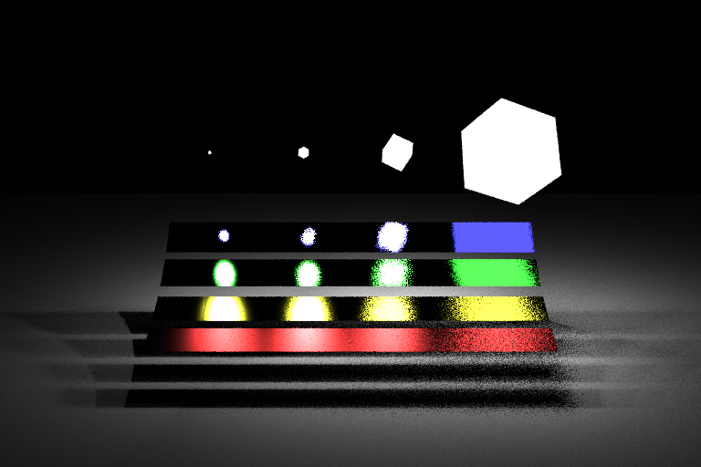
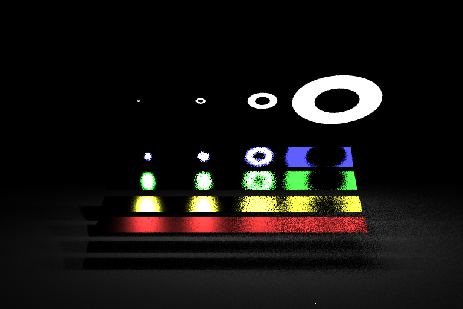
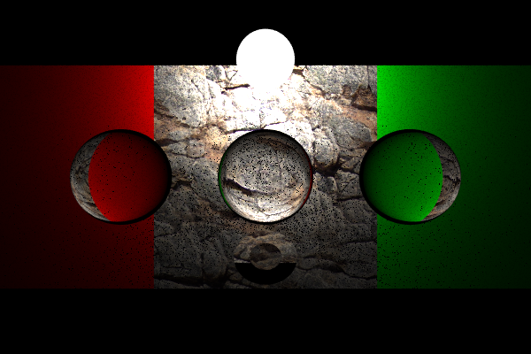
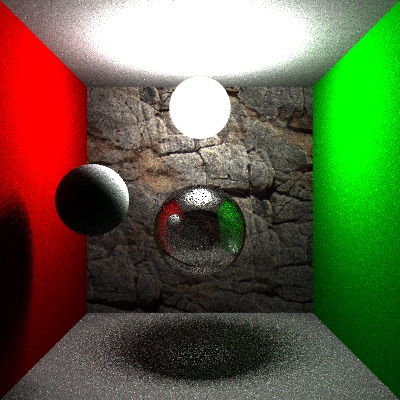
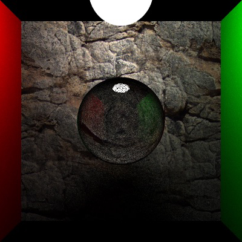
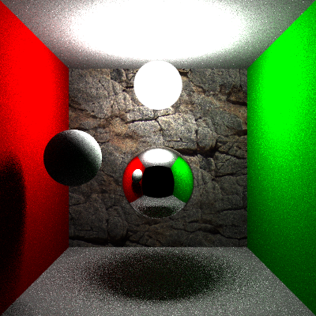
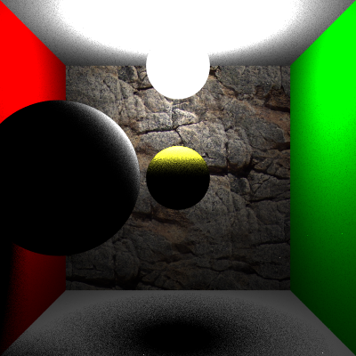
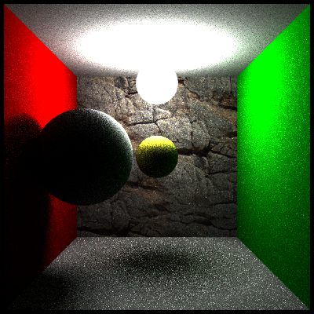

# Graphics_MIS_PT
CIS560 project - Multiple Importance Sampling (MIS) path tracer.

**Sample Renders**
--------------------
MIS - Veach renders 
</img>
</img>
</img>

 

Specular Transmission BxDF Implementation 
</img>

 
Transmission and specular weighted material Implementation 
</img>
</img>

 

Perfect reflection bxdf implemantation 
</img>

 

Direct lighting sample VS MIS 
</img>
</img>
